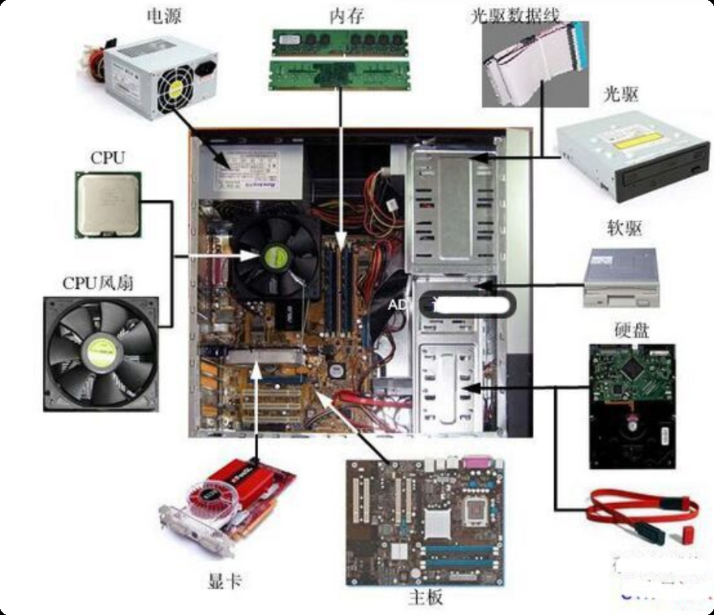
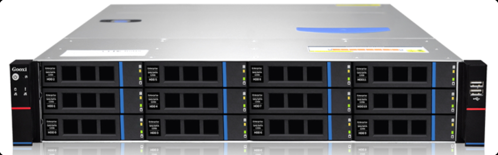
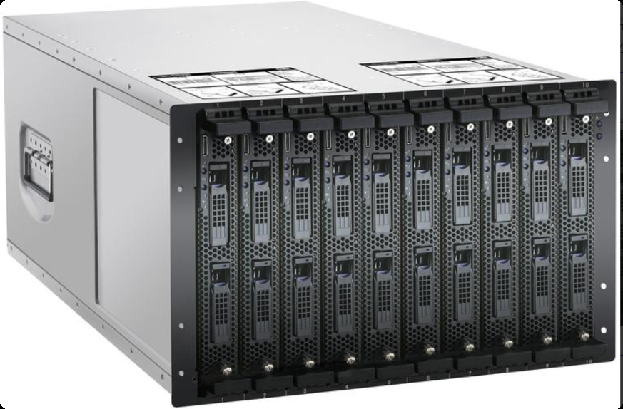
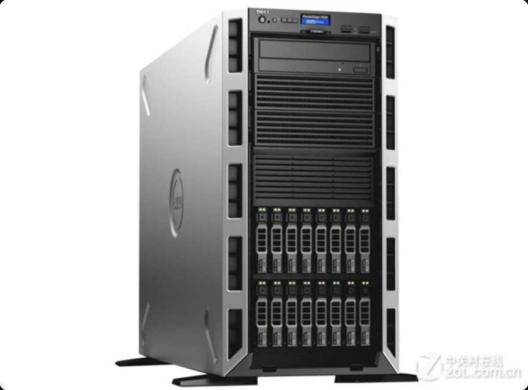
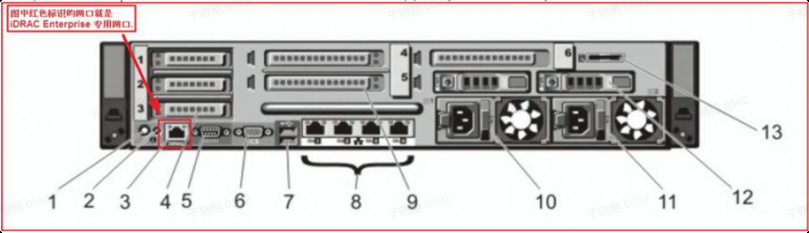

# 1. 计算机介绍

现在的人们几乎无时无刻都在使用电脑，而且已经离不开电脑了。像桌上的台式电脑（桌机）、笔记本电脑（笔电）、平板电脑、智能手机等等，这些东西都算是电脑。

## 1.1. 台式机电脑介绍

计算机又被称为电脑。台式机电脑主要分为主机和显示器两个部分，一般用于家庭娱乐、日常办公，例如：听音乐、打游戏、看电影、做图表等。

- 优点是可以配置独立显卡、声卡、显示器等设备，因此配置会更高一些，使用时更为的方便。
- 缺点是设备体积和重量太大，占地方且移动不方便，在国内的一二线城市已经逐步退出历史舞台了，被简便、小巧并且同样可以高配置的笔记本电脑取代。

## 1.2. 笔记本电脑介绍

笔记本电脑以其简便、小巧、携带方便等优点被更多人选择使用，早期多用于办公，现在已经逐步走进千家万户，成为国内计算机用户的主流选择、和早期不同的是，现在笔记本电脑的部件参数配置也可以很高，并且价格已经下降到普通用户可以接受的程度了。

计算机主机内部结构如下图所示：



# 2. 运维人员工作的主战场—服务器

## 2.1. 什么是服务器？

服务器是提供计算和存储服务的设备。由于服务器需要响应服务请求，并进行处理，因此一般来说服务器应具备承担服务并且保障服务的能力。服务器的构成和通用的计算机结构类似，但是由于需要提供高可靠的服务，因此在处理能力、稳定性、可靠性、安全性、可扩展性、可管理性等方面要求较高。

简单来讲：服务器就是一台特殊的电脑，它的配置更高，设备更贵更好，主要用在企业的后台为用户提供各种业务服务。

在网络环境下，根据服务器提供的服务类型不同，可以分为存储服务器、数据库服务器、负载均衡服务器、WEB 服务器等。

服务器的功能：搭建网站（互联网企业常见应用）等应用服务所使用的机器，相对于其他台式机或笔记本电脑来说，他更加的稳定和可靠。其硬件有 7*24 小时持续运行的能力。

## 2.2. 服务器的尺寸

你们所使用的笔记本电脑的显示器可以按照屏幕大小分为 14 英寸、15.6 英寸等，同样，服务器也是有尺寸的，这个尺寸一般用来描述服务器的高度，即 U（unit）。

服务器的尺寸是以 U（unit） 来做计量单位的，1U 的服务器表示服务器的高度是 1.75 寸（4.45cm）。

常用服务器的大小：1U，2U，4U 等。

## 2.3. 服务器按照外观分类

### 2.3.1. 机架式服务器

机架式服务器的外形看来不像计算机，而像“抽屉”（如下图所示），有 1U、2U、4U 等规格。机架式服务器一般安装在标准的 19 英寸机柜里面。这种类型是我们工作中使用最多的服务器类型。



### 2.3.2 刀片式服务器

刀片式服务器的外观类似一个箱子里摆放整齐的书，刀片式服务器是指在标准高度的机架式机箱内可插装多个卡式的服务器单元，实现高可用和高密度。每一块"刀片"实际上就是一块系统主板。它们可以通过"板载"硬盘启动自己的操作系统，如 Windows NT/2000、Linux 等，类似于一个个独立的服务器，在这种模式下，每一块母板独立运行自己的系统，服务于指定的不同用户群，相互之间没有关联，因此相较于机架式服务器和机柜式服务器，单片母板的性能较低。

不过，管理员可以使用系统软件将这些母板集合成一个服务器集群。在集群模式下，所有的母板可以连接起来提供高速的网络环境，并同时共享资源，为相同的用户群服务。在集群中插入新的"刀片"，就可以提高整体性能。而由于每块"刀片"都是热插拔的，所以，系统可以轻松地进行替换，并且将维护时间减少到最小。



### 2.3.3. 塔式服务器

塔式服务器（Tower Server）应该是最容易理解的一种服务器结构类型。因为它的外形以及结构都跟立式 PC 差不多（如下图所示），当然，由于服务器的主板扩展性较强、插槽也多出一堆，所以个头比普通主板大一些，因此塔式服务器的主机机箱也比标准的 ATX 机箱要大，一般都会预留足够的内部空间以便日后进行硬盘和电源的冗余扩展。但这种类型服务器也有不少局限性，比如，在需要采用多台服务器同时工作，以满足较高的服务器应用需求时，由于其个体比较大，占用空间多，也不方便管理，便显得很不适合使用。



# 3. 公司的服务器品牌

互联网公司常用的服务器品牌如下：

- DELL 戴尔、HP 惠普、IBM、浪潮、长城、联想、华为

要说明的是，现在越来越多的企业直接购买云服务器了，因此，服务器硬件也逐渐变得不像以前那么重要了。随着云服务器的发展，中小企业直接购买硬件的机会越来越少，各类硬件工程师的岗位和前景也越来越不明朗了。

> 什么是云服务器？
>
> 云服务器（Elastic Compute Service， ECS）是一种简单高效、安全可靠、处理能力可弹性伸缩的计算服务。其管理方式比物理服务器更简单高效。用户无需提前购买硬件，即可迅速创建或释放任意多台云服务器。
>
> 简单理解就是：根据用户的需求，进行按量分配。

互联网公司常用的云服务器的品牌如下：

- 阿里云、腾讯云、华为云、天翼云、联通云、AWS 等。

# 4. 服务器核心部件介绍

服务器的内部结构和台式机电脑大同小异，基本零部件和台式电脑一样，例如有 CPU 处理器、内存、磁盘。所不同的是，服务器可以容纳的 CPU 处理器数量更多，风扇也更多，可插拔的硬盘数量也可以多很多。

## 4.1.电源

电源相当于人体的心脏，保障服务器的电力供应，如果要买服务器，请选择质量好的电源。

服务器电源就是指使用在服务器上的电源（POWER），它和 PC（个人电脑）电源一样，都是一种开关电源。

服务器电源按照标准可以分为 ATX 电源和 SSI 电源两种。

- ATX 电源使用较为普遍，主要用于台式机、工作站和低端服务器；
- SSI 电源是随着服务器技术的发展而产生的，适用于各种档次的服务器。

在生产环境当中，若是单个服务器核心业务，最好使用双电源，分别接机房 A、B 线路。如果集群（一堆机器做一件事）的情况下可以不使用双电源。除此之外，运维工作就不用过多考虑电源的其他问题了。

## 4.2. CPU

CPU 处理器相当于人体的大脑，负责整个计算机的运算和控制，是服务器性能效率的最核心部件。

CPU 常见的种类分为精简指令集和复杂指令集两类：

- 精简指令集【RISC】的典型代表包括 Sun 公司的 Sparc 系列以及 ARM 系列。这类 CPU 的设计理念是精简指令数量，使每个指令执行时间更短，操作更简单，从而提高执行效率和整体性能。
- 复杂指令集【CISC】的代表则是我们熟知的 Intel 志强系列（XEON）和 AMD 系列，目前 Intel 的 XEON 系列在服务器领域应用广泛，而 AMD 系列相对较少。这类 CPU 的指令数量多、结构复杂，虽然单个指令执行时间较长，但能够处理更复杂、更丰富的任务。目前我们常用的个人电脑和企业服务器大多采用这类架构。Intel 和 AMD 的处理器都属于 x86 架构，主要用于 PC 以及 Dell 等主流品牌的服务器产品中。

在服务器领域中，CPU 的物理数量通常以“路数”来表示。

- Dell R630 是双路 1U 服务器，Dell R720 是双路 2U 服务器，Dell R830 是四路 2U 服务器。

CPU 的性能通常用频率（GHz）来衡量。。

- 简单来说，CPU 的频率越高，其每秒钟可执行的运算次数就越多，处理速度也就越快。

企业级物理服务器的常见硬件配置：

- 在一般企业中，服务器通常配置 2 到 4 颗 CPU，每颗 CPU 多为四核。内存总量一般在 16G 到 256G 之间，其中 32G 和 64G 是较常见的选择。
- 作为虚拟化宿主机（如运行 VMware 或 KVM 等虚拟化软件）的服务器，CPU 数量通常可达 4 至 8 颗，内存总量一般在 48G 到 128G 之间。在此配置下，企业通常可以同时启动 6 到 10 个虚拟机，具体数量会根据业务需求及分配给每个虚拟机的资源大小进行调整。

在企业级系统运维中，合理选择 CPU 硬件配置，以及对服务器系统 CPU 性能进行监控和优化，是运维人员的重要日常工作之一。

CPU 的性能优化涉及多方面因素，需要长期实践和持续观察才能做到精细化调优。

Dell 服务器型号命名规则示例（以 R720 为例）：

- R 表示机架式服务器（T = 塔式，M = 刀片式）。
- 7 表示服务器路数信息：1–3 代表单路，4–7 代表双路，8 可能代表双路或四路，9 代表四路。
- 2 代表服务器代数，例如 0 代表第十代，2 代表第十二代，依此类推。
- 0 代表使用的 CPU 品牌：0 = Intel，5 = AMD。

## 4.3. 风扇

由于 CPU 在长时间高负载运行时会产生大量热量，因此需要配备散热装置，如 CPU 风扇或散热片。散热片通常由金属铜或铝制成，主要作用是快速传导和散发热量，确保 CPU 稳定运行。

## 4.4. 内存

内存（RAM）是服务器中的一个临时存储器，它只负责数据的中转而不能永久保存。若断电，则数据就会丢失。

作用：内存是 CPU 和磁盘之间的缓冲设备，一般程序运行的时候会被调度到内存中执行，服务器关闭或程序关闭之后，数据自动从内存中释放掉。

特点：内存的容量和处理速度直接决定了电脑数据传输的快慢。

### 4.4.1. buffer 和 cache 的区别

缓冲区（buffer）

1. 将数据写入到内存中，这个存放数据的内存空间在 linux 系统中一般被称为缓冲区（buffer），例如：写入到内存缓冲区，即写缓冲。
2. 为了提高写操作性能，数据在写入最终介质或下一层级介质前，会合并放在缓冲区中。这样会增加数据持久写的延时，因为第一次写入缓冲区后，在向下写入数据之前，还要等待后续的写入，以便凑够数据或者定时写入到永久存储介质中。

缓存区（cache）

1. 从内存里读取数据，这个存放数据的内存空间在 linux 系统中一般被称为缓存区（cache），例如：从内存读取，即读缓存。
2. 操作系统用缓存来提高文件系统的读性能和内存分配性能，应用程序使用缓存也是为了提升读的访问效率。将经常访问的操作结果保存在缓存中可备随时使用，从而避免了总是执行读磁盘取数据等的一些操作，从而减轻了磁盘的压力。

## 4.5. 磁盘

磁盘就是永久存放数据的存储器，不过磁盘上面也是有缓存的（芯片）。存储的内容一般有视频，文本，音频等各种数据，现在已经成为电脑和服务器不可缺少的配件。

作用：由于计算机在工作时，CPU、输入输出设备与存储器之间要进行大量地交换数据，因此存储器的存取速度和容量也是影响计算机运行速度的主要因素之一。特别是在服务器优化场景下，硬盘的性能是决定网站性能的重要因素之一。

### 4.5.1. 磁盘存储类型

HDD，机械硬盘：依靠磁头在旋转盘片上读写数据，容量大、价格低，但速度慢、抗震性差、功耗较高。

SSD，固态硬盘：基于 NAND 闪存，无机械结构，速度快、抗震、静音、功耗低，但单位容量价格高于 HDD（尽管差距不断缩小）。

### 4.5.2. 磁盘接口类型

磁盘的接口包括 IDE，SCSI，SATA（民用），SAS（服务器标配），PCI-E（M2）、其中 IDE、SCSI 已经退出历史舞台。

- IDE：称 PATA（Parallel ATA），早期个人计算机常用的硬盘接口，速度慢、线缆粗、不支持热插拔，现已基本淘汰。

- SCSI：主要用于早期工作站和服务器，性能优于 IDE，支持多设备连接和命令队列，但成本高、复杂度大，已被 SAS 取代，退出主流市场。

- SATA：IDE 的继任者，广泛用于民用台式机和笔记本电脑，具有成本低、功耗低、线缆细等优点。目前主流版本为 SATA III（6 Gbps）。主要用于机械硬盘（HDD）和部分固态硬盘（SSD）。

- SAS：SCSI 的串行版本，兼容 SATA 接口（物理兼容，但 SATA 不能插在 SAS 控制器上反向使用），具备更高的可靠性、带宽和企业级特性（如双端口、长距离、纠错能力等），是企业级服务器和存储系统的标准配置。

- PCI-E：原本是高速总线接口，现被广泛用于高性能 SSD。通过 M.2 或 U.2 等物理形态接入，NVMe 协议运行在 PCIe 之上，提供极高的 IOPS 和吞吐量。主流高性能固态硬盘（如 NVMe SSD）均采用 PCIe 接口。M.2 是一种物理规格/外形尺寸，可支持 SATA 或 PCIe/NVMe 两种协议。因此，并非所有 M.2 都是 PCIe 接口，需看具体协议支持。

### 4.5.3. 性能（IOPS / 延迟 / 吞吐量）

PCIe/NVMe SSD > SAS SSD > SATA SSD > SAS HDD > SATA HDD

### 4.5.4. 单位价格

PCIe/NVMe SSD > SAS SSD > SATA SSD > SAS HDD ≈ SATA HDD

## 4.6. 磁盘冗余阵列（RAID）

RAID（磁盘冗余阵列）是一种将多块物理硬盘整合为一块逻辑磁盘的技术，主要用于解决数据存储容量、安全性和访问效率等问题。

RAID 的实现方式分为软 RAID（软件实现）和硬 RAID（硬件实现）两种，二者的主要区别在于：硬 RAID 拥有独立的 RAID 卡芯片，性能更高、冗余能力更强，处理数据时不需要占用系统 CPU 资源，而软 RAID 则依赖操作系统实现，性能和稳定性相对较低。

随着业务发展和数据量不断增长，单块硬盘的存储空间往往很快就不够用了。此时，企业通常会采购多块硬盘来扩展存储能力，而 RAID 技术正好可以将这些多块硬盘整合成一个大容量的逻辑磁盘，然后在此逻辑磁盘上进行分区，划分出虚拟磁盘用于存放数据。但硬盘数量增多也带来了更高的故障风险，而数据又是不能丢的。因此，RAID 的另一大重要功能就是提供数据冗余（即数据备份），通过配置冗余策略，即使部分硬盘发生损坏，数据依然可以完整保留，不受影响。

此外，不同的业务场景对数据访问效率也有不同要求，为了在容量、性能和数据安全之间取得平衡，RAID 技术又衍生出多种工作级别，常见的包括 RAID 0、RAID 1、RAID 5、RAID 10 等，不同级别在读写性能、数据冗余和磁盘利用率方面各有侧重，企业可根据实际需求进行选择。

有 Raid 卡后，一般会把磁盘连接到 Raid 卡上，而不是直接插到主板上了，Raid 卡最终插到主板对应的插槽里。

硬 Raid 卡又分为两种，即：

- 服务器板载 Raid 卡，仅支持 Raid0 和 Raid1 级别。
- 独立 Raid 卡，支持更多的功能。

互联网公司服务器一般都会购买独立 Raid 卡，当然，Raid 卡上也是有缓存的。

### 4.6.1. RAID0（条带化 / Striping）

**原理：**把数据按块（Block）切分后，依次分布到多块硬盘上。

**示意图：**

```Plain
数据块:  A1  A2  A3  A4  A5  A6
硬盘1:   A1      A3      A5
硬盘2:       A2      A4      A6
```

**特点：**

- 读写速度最快
- 无冗余，坏一块盘数据全丢
- 最少需要 2 块硬盘
- 可用容量 = 所有硬盘容量之和

**适用场景：**对速度要求高、数据不重要（如缓存、临时文件）。

### 4.6.2. RAID 1（镜像 / Mirroring）

**原理：**每块数据写入两块硬盘，互为镜像。

**示意图：**

```Plain
硬盘1:  A1  A2  A3  A4
硬盘2:  A1  A2  A3  A4
```

**特点：**

- 数据安全性高
- 可坏一块盘
- 容量利用率 50%
- 最少需要 2 块硬盘
- 可用容量 = 硬盘容量/2

**适用场景：**数据库、重要文件服务器。

### 4.6.3. RAID5（条带 + 分布式校验）

**原理：**数据分布写入，同时生成“校验信息（Parity）”，校验块分布在不同硬盘。

**示意图（3 盘示例）：（P = 校验块）**

```Plain
硬盘1:  A1   A2   P3   A4
硬盘2:  A1   P2   A3   A4
硬盘3:  P1   A2   A3   P4
```

**特点：**

- 可坏 1 块硬盘
- 读性能好
- 写性能一般（需计算校验）
- 最少需要 3 块硬盘
- 可用容量 = （N-1） × 单盘容量

**适用场景：**企业文件存储、NAS。

### 4.6.4. RAID01 ( RAID0+RAID1) 

**原理：**先做 RAID 0（条带），再做 RAID 1（镜像）。

**结构示意：**

```Plain
先条带:
  组A:  硬盘1 + 硬盘2
  组B:  硬盘3 + 硬盘4

再镜像:
  组A <==镜像==> 组B
```

**特点：**

- 最少 4 块硬盘
- 容错能力较弱（某组坏一块后风险变高）
- 可用容量 = 总容量的一半
- 性能好

### 4.6.5. RAID10( RAID1+RAID0) 

**原理：**先做 RAID 1（镜像），再做 RAID 0（条带）。

**结构示意：**

```Plain
先镜像:
  组A:  硬盘1 <==> 硬盘2
  组B:  硬盘3 <==> 硬盘4

再条带:
  组A + 组B
```

**特点：**

- 最少 4 块硬盘
- 可坏多块硬盘（只要不在同一镜像组）
- 性能好
- 可用容量 = 总容量的一半
- 综合性能与安全性最好

**适用场景：**数据库、虚拟化、高并发服务器。

### 4.6.6. 比较

- 冗余从好到坏：Raid1、Raid10、Raid5、Raid0
- 性能从好到坏：Raid0、Raid10、Raid5、Raid1
- 成本从低到高：Raid0、Raid5、Raid1、Raid10

## 4.7. 光驱

光驱作为一个设备也已经几乎退出历史舞台了，几乎所有的影视剧、音乐等也都不再用光驱发行了。

光驱的功能：听歌，看牒，装软件，用游戏光牒打游戏等等。

但是在某些特殊行业中，仅可支持通过光驱进行数据的刻录与拷贝。

## 4.8. 远程管理卡

远程管理卡是服务器特有的远程管理部件，在家用电脑及笔记本电脑上是不存在的。

它的作用是通过网络远程（异地）开关服务器，并可以查看服务器开关机的过程等信息，早期（2010 年以前），服务器托管在 IDC 机房，一旦出现问题，还得跑机房或者请机房的人管理。有了远程管理卡之后，运维人员管理服务器的效率就大大的提高了。

远程管理卡有服务器自带的和独立的两类。

- 服务器自带的远程管理卡，可以关机、开机，但是看不到开关服务器的过程。
- 所以，建议给服务器配备独立的远程管理卡，可能会多花 100 多块钱的样子，但是，当服务器出现问题，就不需要打车或者出差，也不用给机房人员打电话了，可以利用远程管理卡快速查看服务器故障并恢复服务。

在 Dell 服务器中，远程管理卡叫做 iDRAC 又称为 Integrated Dell Remote Access Controller，也就是集成戴尔远程控制卡。



### 4.9. 显卡

显卡是计算机中负责图像处理和显示的部件，主要作用是将计算机处理的数据转换成图像信号输出到显示器上。对于服务器来说，显卡的性能通常不是重点，因为服务器主要用于处理数据和提供服务，而不是进行图形渲染或游戏等需要高性能图形处理的任务。

不过，在某些特定的服务器应用场景中，如图形工作站、视频编辑服务器、人工智能训练服务器等，对显卡性能有较高要求，这时就需要配备高性能的专业显卡（如 NVIDIA Quadro 或 AMD Radeon Pro 系列）来满足图形处理需求。
