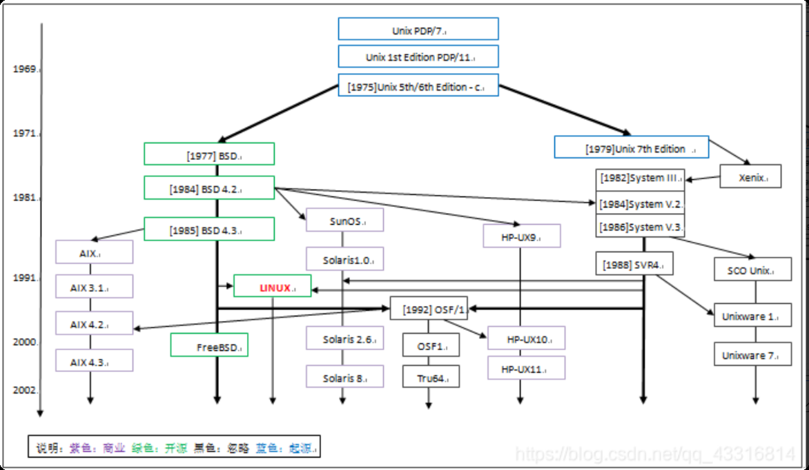
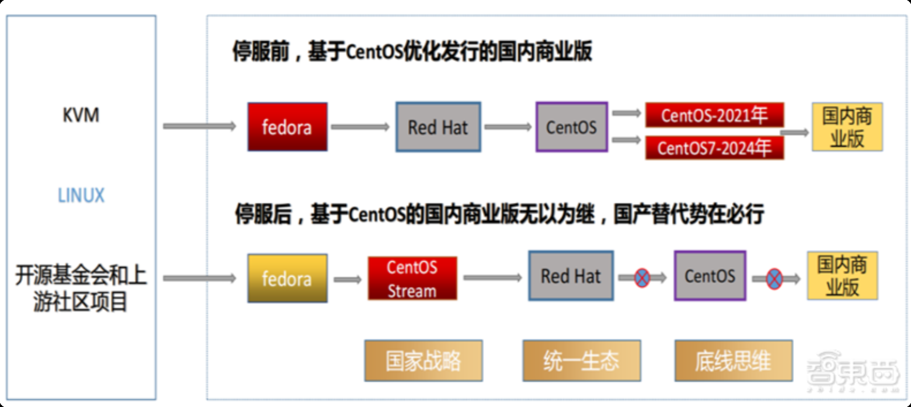

# 1. 操作系统的发展

## 1.1. 早期发展阶段

20 世纪 50 年代至 60 年代,计算机操作系统经历了从无到有的阶段，主要特点包括：

- 单用户系统：早期计算机采用单用户模式，一次仅支持一个用户程序运行，用户通过命令行与系统交互，典型代表如 DOS。
- 批处理系统：为提升效率，引入批处理机制，用户提交作业后由操作系统自动连续执行，无需实时干预。随后发展的多道程序设计技术，使多个程序可同时驻留内存，通过调度机制共享 CPU，显著提高了资源利用率。

## 1.2. 分时系统和多用户系统

20 世纪 60 年代末至 70 年代,操作系统进入了分时系统和多用户系统的阶段，主要特点包括：

- 分时操作系统：通过时间片轮转技术，将 CPU 时间划分为小片段，轮流分配给多个用户终端，实现多用户并发使用同一台计算机，显著提升了交互性和系统利用率。
- 多用户系统：以 UNIX 为代表的操作系统在此时期诞生，具备多用户、多任务、可移植等特性，奠定了现代操作系统的设计基石，对后续系统发展产生深远影响。

## 1.3. 个人计算机操作系统
20 世纪 80 年代,随着个人计算机的普及，操作系统也朝着更加用户友好和图形化的方向发展，主要特点包括：

- 随着个人计算机（PC）的普及，操作系统也朝着更加用户友好和图形化的方向发展。
- Mac 于 1984 年 1 月 24 日发布了 System 1.0 操作系统。
- Windows 操作系统于 1985 年 11 月 20 日正式发布。
- 苹果公司的 Mac OS 和 微软的 Windows 操作系统，先后引入了图形用户界面（GUI）。

## 1.4. 网络操作系统和分布式操作系统
20 世纪 80 年代末至 90 年代,随着网络技术的飞速发展，操作系统开始集成网络通信与资源共享功能，形成了网络操作系统。

同时，分布式操作系统应运而生，能够统一管理多台计算机资源，使其协同工作，提升整体性能与可靠性，广泛应用于科研与企业环境。

## 1.5. 现代操作系统
2000 年代至今,操作系统进入了多样化与定制化、实时操作系统、新兴操作系统（HarmonyOS）等阶段，主要特点包括：
- 多样化与定制化：现代操作系统如 Windows、macOS、Linux 等，提供了丰富的功能和用户界面，满足不同用户需求。同时，针对特定领域的定制化操作系统（如嵌入式系统、移动设备）也在不断发展。
- 实时操作系统：随着物联网和自动化技术的发展，实时操作系统（RTOS）成为关键技术，能够在严格的时间限制内响应外部事件，广泛应用于工业控制、汽车电子等领域。
- 新兴操作系统：如华为的 HarmonyOS，旨在实现跨设备的无缝连接和协同工作，推动智能设备生态系统的发展，成为未来操作系统的重要趋势之一。

# 2. 操作系统的分类

目前服务器的主流操作系统主要包括 Windows Server、Linux（如 Ubuntu、CentOS 等）和 Unix（如 Solaris、HPUX 等）三大平台。

## 2.1. Windows Server

Windows Server 是微软公司推出的服务器操作系统平台，主要面向企业级用户。友好的图形用户界面（GUI），简化了服务器管理的复杂性。

通常部署在需要运行 Microsoft 特定软件解决方案的场景中。

## 2.2. Unix

Unix 是一个历史悠久的多用户、多任务操作系统，以其稳定性和安全性著称。

尽管 Unix 的直接使用不如 Windows 和 Linux 普遍，但其设计理念和许多核心工具对现代操作系统产生了深远影响。

传统上被用于大型机、工作站和高性能计算环境，市场份额占比较小，在某些专业领域，如科研和工程计算中仍然占据一席之地。

## 2.3. Linux

Linux 是一种开源的、免费的操作系统平台，由林纳斯·托瓦兹创造。

Linux 支持多种硬件平台，并且由于其开源本质，在全球范围内有一个庞大的开发者和用户社区。

常被用于服务器、云计算环境、大数据处理和嵌入式系统中，其低成本和高度可定制性使其成为工程师的首选。

# 3. Unix

## 3.1. UNIX 的起源与发展

UNIX 最早由肯·汤普森（Ken Thompson）和丹尼斯·里奇（Dennis Ritchie）等人于 1969 年至 1970 年间在美国贝尔实验室（Bell Labs）开发。

最初，UNIX 是用汇编语言在 DEC 公司的 PDP-7 小型机上实现的，其设计目标是构建一个支持多用户、多任务的操作系统环境，核心组件包括文件系统、命令解释器（shell）、以及一系列实用工具程序。

## 3.2. 可移植性的突破

1973 年，UNIX 被用 C 语言重新编写，这一举措具有里程碑意义。由于 C 语言兼具高级语言的可读性与接近硬件的控制能力，UNIX 的可移植性和可维护性大幅提升。这使得 UNIX 不再局限于 PDP 系列机器，而能够被移植到多种硬件平台上。

此后，UNIX 迅速在学术界和工业界传播。到 1978 年，全球已有约 600 台计算机运行 UNIX 系统。

## 3.3. UNIX 的定型与分化

1979 年，贝尔实验室发布了 UNIX Version 7（V7）。这是历史上第一个功能完整、结构清晰的 UNIX 版本，也被视为最后一个广泛发布的研究型 UNIX，对后续系统影响深远。

进入 1980 年代，AT&T（美国电话电报公司）开始将 UNIX 商业化，推出了 System V 等官方商业版本。与此同时，加州大学伯克利分校（UC Berkeley）的计算机系统研究小组（CSRG）也在 UNIX 基础上进行了大量改进与扩展，发布了 BSD（Berkeley Software Distribution）系列。BSD 引入了虚拟内存、TCP/IP 网络协议栈等关键技术，形成了 UNIX 的另一大重要分支。

受 BSD 和 System V 的启发，各大硬件厂商纷纷基于自身架构开发定制化的 UNIX 系统，由此诞生了多个著名的商业 UNIX 变种，例如：
- Sun Microsystems 的 Solaris
- IBM 的 AIX
- HP 的 HP-UX
这些系统虽然共享 UNIX 的核心理念，但彼此之间缺乏兼容性。

## 3.4. 版权争议与教学困境
20 世纪 70 年代末至 80 年代初，UNIX 面临两大挑战：
1. 各厂商的 UNIX 实现高度依赖特定硬件，导致软件难以跨平台运行。
2.  AT&T 收回 UNIX 源代码的使用权，并禁止向高校学生公开源码。这一政策严重限制了 UNIX 在计算机教育中的应用。
为应对这一局面，荷兰计算机科学家 安德鲁·塔能鲍姆（Andrew S .Tanenbaum）【中文名：谭宁邦】于 1987 年开发了 Minix，一个专为教学目的设计的类 UNIX 微内核操作系统，可在当时普及的 x86 个人计算机上运行。
尽管 Minix 功能有限，无法满足商业需求，但它为学生提供了学习操作系统原理的实践平台，并直接启发了后来 Linux 的诞生。

# 4. GNU/Linux

## 4.1. GNU 项目的诞生
由于 Unix 和 BSD 对于许多的 Unix 的爱好者和软件开发者们都不友好，不允许他们自由使用 Unix，从而产生了一些使用层面的冲突。

理查德·斯托曼(Richard Stallman) 认为 Unix 是一个相当好的操作系统，如果大家都能够将自己所学贡献出来，那么这个系统将会更加的优异！他倡导的 Open Source 的概念，就是针对 Unix 这一事实反对实验室里的产品商业化私有化。

为了这个理想，Richard Stallman 于 1984 年创业了 GNU，计划开发一套与 Unix 相互兼容的的软件。1985 年 Richard Stallman 又创立了自由软件基金会（Free Software Foundation）来为 GNU 计划提供技术、法律以及财政支持。也就是说：GNU 的目标是编写大量兼容于 Unix 系统的自由软件。

官方网站： https://www.gnu.org

自 90 年代发起这个计划以来，GNU 开始大量的产生或收集各种系统所必备的组件，像是——函数库、编译器、调式工具、文本编辑器、网站服务器，以及一个 Unix 的使用者接口（Unix shell）等等。

GNU 计划的核心是 GNU General Public License（GPL），这是一种自由软件许可证，允许用户自由使用、修改和分发软件，但要求任何基于 GPL 许可的软件的衍生作品也必须遵守同样的许可证。这种“传染性”确保了 GNU 软件及其衍生作品始终保持自由。后续，随着时间的推移，越来越多的协议随之产生，像是 BSD 许可证、MIT 许可证、Apache 许可证等等，这些协议都在不同程度上促进了开源软件的发展。

## 4.2. Open Source 与 Free Software 的诞生

1998 年的 2 月 5 日，一场小型聚会在美国加州的 VA 研究中心举行，与会的人包括了一众信息技术领域的知名学者和工程师。正是在这场会上，大家同意了 Christine Peterson 女士提出的用“开放源代码” （Open Source）一词来替代容易在英语人士中引起歧义的“自由软件”（Free Software）一词，表达的是同样的软件和意思，但更方便理解更容易获取更多支持。从那一天开始，“开源” 正式诞生。

Open Source 代表着开源的概念，是一种软件发展和共享的理念与模式，强调软件的源代码应该公开，允许其他人自由地使用、修改和分发，以促进软件技术的交流与创新，形成一个开放、协作的软件生态环境。它是一个较为宽泛的概念，涵盖了各种遵循开源原则的软件项目和相关的实践活动。

软件和源代码提供给所有人，自由分发软件和源代码，free 自由，不是免费的意思 - 能够修改和创建衍生作品。

软件分类：
- 商业：收费，源码也不公开
- 共享：免费使用，但源码不公开
- 自由：源代码公开

世界上的开源许可证，大概有上百种。

### 4.2.1. GPL 协议
GPL：GNU General Public License 通用公共许可证，是一种广泛应用的开源软件许可证。

GPL 的核心是确保软件的自由使用、修改和分发。它允许任何人免费获取、使用和修改软件代码，前提是基于该软件的衍生作品也必须以 GPL 许可发布，且要保留原作者的版权声明等信息，这也被称为 “传染性” 条款，保证了软件的开源性质在后续开发中得以延续。

它推动了开源软件的发展，让大量开发者能够共同参与软件的改进和完善，促进了知识共享和技术创新。许多著名的开源项目如 Linux 内核等都采用 GPL 许可证，使得这些项目能够汇聚全球开发者的力量，不断发展壮大。

### 4.2.2. LGPL 协议
LGPL: Lesser General Public License，LGPL 相对于 GPL 较为宽松，允许不公开全部源代码。

非常适合用于开发那些希望被广泛使用和集成到其他软件中的库和框架，如一些开源的数据库连接库、图形界面框架等。开发者可以放心地使用这些 LGPL 许可的库来构建自己的软件，而不必担心整个软件都要强制开源，有利于促进软件组件的共享和复用。

如果只是使用了 LGPL 许可的库，而没有对库本身进行修改，那么基于这个库开发的软件可以选择其他许可证，不一定是开源许可证，即其 “传染性” 主要针对对库本身的修改和分发。

### 4.2.3. BSD 协议
BSD: Berkeley Software Distribution License，BSD 许可证是一种非常宽松的开源软件许可证。

它允许用户自由使用、修改和分发软件代码，甚至可以将其用于商业目的，而不要求公开源代码或衍生作品必须遵守相同的许可证。这种宽松性使得 BSD 许可证非常受欢迎，尤其是在商业软件开发中，因为它允许开发者将开源代码集成到专有软件中，而不需要公开他们的源代码。

> 上述还有许多其他类型的开源许可证，如 MIT 许可证、Apache 许可证等，每种许可证都有其独特的条款和适用场景，开发者在选择使用哪种许可证时需要根据项目的需求和目标来做出决策。

## 4.3.Linux

### 4.3.1 发展

### 4.3.1.1 Linus Torvalds 的“不满”：Minix 的局限

1991 年，芬兰赫尔辛基大学的二年级学生 Linus Torvalds 正在使用 Minix 学习操作系统原理。尽管 Minix 是一个优秀的教学工具，但它存在明显限制：

- 许可证限制：Tanenbaum 教授虽公开了 Minix 源码，但不允许用户自由修改和再分发（早期版本采用非商业许可），违背了“自由软件”精神。
- 架构保守：Minix 采用微内核设计，许多功能（如文件系统、驱动）运行在用户态，性能较低。
- 仅用于教学：缺乏对现代硬件（如 386 保护模式、虚拟内存）的充分支持，无法满足实际开发需求。
- Linus Torvalds 想要一个功能更强、可自由修改、能在自己的 386 PC 上高效运行的类 UNIX 系统。

### 4.3.1.2 Linux 的诞生：从“爱好项目”到开源宣言

1991 年 8 月 25 日，Linus 在 comp.os.minix 新闻组发布著名帖子：

>“Hello everybody out there using minix – I’m doing a (free) operating system (just a hobby, won’t be big and professional like gnu) for 386(486) AT clones…”

他最初将项目命名为 Freax（Free + Freak + Unix 的混合），但 FTP 站点管理员 Ari Lemmke 喜欢 “Linux” 这个名字，便将其上传至 /pub/linux 目录——Linux 由此得名。

1991 年 9 月，Linux 0.01 发布，仅包含不到 1 万行代码，支持基本的进程调度、磁盘驱动和文件系统。

关键决策：1992 年，Linus 将 Linux 内核以 GNU/GPL（通用公共许可证） 发布。这意味着：
- 任何人都可自由使用、修改、分发；
- 所有衍生作品也必须开源（“传染性”条款）；
- 与 GNU 项目的自由软件完美兼容

这一决定极大促进了 Linux 的发展，吸引了全球开发者的参与，形成了庞大的开源社区。Linux 从一个个人爱好项目迅速成长为全球最重要的操作系统之一，广泛应用于服务器、云计算、嵌入式系统等领域。

### 4.3.1.3 GNU/Linux：完整的自由操作系统诞生

此时，Richard Stallman 领导的 GNU 项目（始于 1983 年）已开发出几乎所有操作系统组件：
- GCC 编译器
- Bash shell
- Glibc 标准库
- Coreutils 工具集（ls， cp， grep 等）
- 唯独缺少一个自由的内核（GNU Hurd 进展缓慢）。

Linux 内核的出现，恰好填补了这一空白。
当 Linux 内核与 GNU 软件结合，一个完整、自由、可运行的类 UNIX 操作系统就此形成——这就是今天常被称作 GNU/Linux 的系统（如 Debian、Ubuntu 等）。

### 4.3.1.4 开源社区的爆发式成长
得益于 Internet 和 GPL 协议，世界各地的程序员开始为 Linux 贡献代码、修复漏洞、添加驱动。

标志性事件——“塔能鲍姆-林纳斯辩论”（1992）：

- 安德鲁·塔能鲍姆在新闻组发文，批评 Linux 采用“过时”的宏内核设计，应转向更“先进”的微内核。
- 林纳斯·托瓦兹则反驳道，Linux 的实用性远比理论上的“纯洁性”更重要。这场辩论成为操作系统发展史上的经典，也确立了 Linux 社区“务实优先”的工程哲学。

发行版的兴起（社区与商业模式的探索）：随着内核成熟，便于用户安装使用的“发行版”开始涌现：
- 1993 年：Slackware​ 发布，成为首个广泛流行的发行版。
- 1993 年：Debian​ 诞生，确立了由纯社区驱动、坚守自由软件精神的发行版模式。
- 1994-1995 年：Red Hat​ 出现，其首个版本于1994年发布，公司于1995年成立，开创了“提供免费软件+付费商业支持”的成功模式，证明了开源软件的商业可行性。

## 4.3.2. 内核
从 Linus Torvalds 在 1991 年发布第一版开始，Linux 内核迄今已发展了 30 余年。据称，第一版的 Linux 内核只有 10250 行代码，占用 65 KB，而如今，Linux 内核代码行数早已达数千万行。

最新版本：6.18.5【stable，2026-01-17】

官网： https://www.kernel.org/

- mainline: 主线开发版本
- stable：稳定版本
- longterm：长期支持版本
- EOL：不再提供支持更新

# 5. Linux 发行版

由于 Linus 认为好的软件是需要免费和商业化共同推进的，所以 Linux 既不排斥开源，也不排斥商业化，这也造就了今天的 Linux 火红的局面。

随着社区的发展壮大，Linux 逐渐从一个小众的操作系统项目成长为一个拥有庞大用户群体和广泛应用的开源操作系统，越来越多的企业和组织开始认识到其商业价值。Red Hat、SUSE、Canonical 等商业公司纷纷推出基于 Linux 的商业发行版，并提供技术支持和服务。

Linux 分支参考网站： https://github.com/FabioLolix/LinuxTimeline/releases

Linux 发行版排名： https://distrowatch.com/dwres.php?resource=popularity

常见版本简介：

- SUSE 系列
    - SUSE Linux Enterprise Server（SLES）是 SUSE 公司推出的企业级 Linux 发行版，提供稳定性和长期支持，适用于服务器环境。
    - openSUSE 是 SUSE 的社区版本，提供最新的软件包和功能，适合开发者和 Linux 爱好者使用。

- Debian 系列
    - Ubuntu 是 Debian 的一个分支，专注于用户友好和桌面体验，成为最受欢迎的 Linux 发行版之一。
        - Mint 是基于 Ubuntu 的发行版，注重美观和易用性，适合新手用户。
    - Kali Linux 是基于 Debian 的安全测试和渗透测试发行版，预装了大量安全工具，广泛用于网络安全领域。
    - Deepin 是基于 Debian 的中国发行版，注重美观和易用性，适合国内用户使用。

- Red Hat 系列
    - RHEL: Red Hat Enterprise Linux，每 18 个月发行一个新版本
    - CentOS：Community Enterprise Operating System，兼容 RHEL 的格式
    - Fedora：每 6 个月发行一个新版本
    - Rocky Linux：由 CentOS 社区创建的 RHEL 克隆版，旨在提供一个稳定的企业级 Linux 发行版。
    - AlmaLinux：由 CloudLinux 公司创建的 RHEL 克隆版，提供长期支持和稳定性，适合企业用户使用。
    - 中标麒麟：基于 RHEL 的国产 Linux 发行版，适用于政府和企业用户，强调安全性和自主可控。

- 其他系列
    - Arch Linux：一个滚动更新的发行版，强调简洁和用户自定义，适合高级用户。
        - Manjaro：基于 Arch Linux 的发行版，提供更友好的安装和用户体验，适合新手用户.
    - Alpine Linux：一个轻量级的发行版，专为容器环境设计，强调安全性和资源效率，广泛用于 Docker 镜像和云原生应用中。
    - Gentoo：一个源代码发行版，用户需要从源代码编译安装软件，适合高级用户和开发者。

## 5.1. Red Hat 系列

Red Hat 是一家成立于 1993 年的美国开源软件公司，早期以 Red Hat Linux（桌面/服务器通用发行版）闻名。
2003 年，Red Hat 做出重大战略调整：
- 停止维护免费的 Red Hat Linux
- 推出 Red Hat Enterprise Linux（RHEL） —— 一个面向企业客户的商业发行版，提供长期支持（7–10 年）、安全更新、专业技术服务。

RHEL 的核心特点
- 稳定、安全、认证兼容（如 Oracle DB、SAP 等）
- 付费订阅制：用户需购买订阅才能获得官方支持、补丁和知识库
- 源代码公开：根据 GPL 协议，Red Hat 必须公开 RHEL 的完整源代码

红帽认证：
- 红帽认证是目前世界范围内高度认可的 Linux 行业认证。红帽认证体系有三个等级，分别是 RHCSA（红帽认证系统管理员）、RHCE（红帽认证工程师）、 RHCA （红帽认证的系统架构师）。

## 5.2. CentOS
### 5.2.1. 诞生（2004 年）
CentOS 创始人之一 Gregory Kurtzer 发现：既然 RHEL 源码是公开的，为什么不重新编译一份完全兼容但免费的版本。
于是 CentOS（Community ENTerprise Operating System）项目诞生。

目标：100% 二进制兼容 RHEL，去掉 Red Hat 商标，免费提供给社区使用。

### 5.2.2. CentOS 的运作方式
Red Hat 发布 RHEL 源码（通过 SRPMS）。

CentOS 团队去除商标、重新编译。

发布几乎 identical 的 CentOS 版本（通常延迟几周到几个月）。

### 5.2.3. 为什么 CentOS 大受欢迎？

免费：中小企业、个人开发者、教学环境无需支付订阅费。

兼容 RHEL：在 CentOS 上开发的软件，可无缝迁移到客户付费的 RHEL 环境。

稳定可靠：继承 RHEL 的企业级品质。到 2010 年代，CentOS 成为全球最流行的 Linux 服务器发行版之一，尤其在 Web 托管、云计算领域占据主导地位。

### 5.2.4. 被 Red Hat 收购（2014 年）
Red Hat 宣布收购 CentOS 项目。

初期承诺：保持 CentOS 免费、独立、与 RHEL 同步
社区普遍欢迎，认为 Red Hat 能提供更好资源支持。

---
🕰️ 2003–2004 年：CentOS 诞生

Gregory Kurtzer 与他人（包括 Rocky McGaugh 等）共同发起 CentOS 项目。

目标：基于 Red Hat 公开的 RHEL 源代码，构建一个免费、社区驱动、100% 兼容 RHEL 的发行版。

当时 Kurtzer 是核心维护者之一，但 CentOS 始终是一个松散的社区项目，缺乏稳定资金和法律支持。

⚠️ 2005–2013 年：运营困境

CentOS 团队面临诸多挑战：
法律风险：因使用 RHEL 衍生代码，担心 Red Hat 起诉商标或版权问题；

资源匮乏：无公司支持，靠志愿者维护，发布延迟严重；

基础设施薄弱：缺乏 CDN、镜像网络、CI/CD 系统等。

Kurtzer 曾公开表示：“我们就像在黑暗中摸索，随时可能被 Red Hat 起诉。”

🤝 2014 年 1 月：CentOS 加入 Red Hat

Red Hat 宣布正式赞助 CentOS 项目，并成立 CentOS 董事会。条件：
- CentOS 项目的商标、域名、基础设施等资产转移给 Red Hat；
- 原 CentOS 核心成员（包括 Kurtzer）加入新董事会；
- Red Hat 承诺不干预技术方向，保持 CentOS 免费、开源、独立。

Gregory Kurtzer 同意移交，因为他认为这是 CentOS 唯一可持续发展的路径。
这不是“卖”，而是将项目托管给有能力支持它的企业，以换取合法性、资源和长期生存能力。

🕰️ Kurtzer 离开 CentOS
- 尽管初期参与新董事会，但 Kurtzer 很快对 Red Hat 的实际影响力感到失望。
- 他于 2015 年前后逐渐淡出 CentOS 项目，转而投身高性能计算（HPC）领域（如创建 Warewulf 集群工具）。
- 到 2020 年 Red Hat 宣布终结 CentOS Linux 时，Kurtzer 已完全不在项目中。
---

### 5.2.5. CentOS Stream 的推出（2020 年）
2018 年 10 月 29 日，IBM 宣布将以约 340 亿美元收购开源软件和技术主要供应商红帽公司。

2020 年 12 月，Red Hat（此时已被 IBM 收购）为了强制用户使用付费版本，突然宣布：CentOS Linux（传统版本）将在 CentOS 8 生命周期结束后（2021 年底）停止维护，未来只支持 CentOS Stream。

什么是 CentOS Stream？
- 它不是 RHEL 的下游克隆，而是 RHEL 的上游开发分支。
- 换句话说：
  - 旧 CentOS：RHEL → 编译 → CentOS（稳定、滞后）
  - CentOS Stream：开发者提交代码 → CentOS Stream → 测试 → RHEL（滚动预览版）

企业用户怒了：“我们用 CentOS 就是因为它稳定，现在变成‘测试版’？”

开发者困惑：“我怎么敢在生产环境跑一个比 RHEL 还新的系统？”

信任崩塌：许多人认为 Red Hat / IBM 是为了逼用户购买 RHEL 订阅而“背刺”社区。

这一事件被广泛称为 “CentOS 门”（CentOS-gate），成为开源社区信任危机的经典案例。

面对 CentOS 的“背叛”，社区迅速行动：

- Rocky Linux（2021 年）
  - 创始人：Gregory Kurtzer —— 正是 CentOS 项目的原始创始人之一！
  - 命名致敬：纪念 Red Hat 联合创始人 Rocky McGaugh
  - 目标：打造一个 真正免费、社区驱动、100% RHEL 兼容 的替代品
  - 口号：“The Enterprise OS， without the enterprise price tag。”

- AlmaLinux（2021 年）
  - 由云服务商 CloudLinux Inc。 发起
  - 同样承诺 1:1 RHEL 兼容，免费、开源、长期支持
  - 名字“Alma”在拉丁语中意为“灵魂”（soul），象征对 CentOS 精神的继承，两者都迅速获得 AWS、Google Cloud、Microsoft Azure 等主流云平台官方支持。

---
💥 Kurtzer 的“回归” —— Rocky Linux

- 当 2020 年 Red Hat 宣布放弃 CentOS Linux 时，Kurtzer 公开批评这一决定背叛了社区信任。

- 他随即宣布启动 Rocky Linux，明确表示：“我要重建 CentOS 最初的精神 —— 一个真正由社区拥有、免费、稳定的 RHEL 克隆。”

- 这被视为他对 2014 年“托付失败”的一种回应和救赎。
---

## 5.3. Rocky Linux
Rocky Linux 已经发布了多个版本，包括 Rocky Linux 8.x 和 Rocky Linux 9.x 系列。

其中，Rocky Linux 9.x 系列采用了更新的 Linux 内核和更强大的功能特性。

Rocky Linux 的首个候选版本于 2021 年 4 月 30 日发布，而 Rocky Linux 9.0 则于 2022 年 7 月 16 日全面上市。

## 5.4. AlmaLinux
AlmaLinux 的首个候选版本于 2021 年 3 月 30 日发布，而 AlmaLinux 8.4 则于 2021 年 6 月 21 日全面上市。

## 5.5. Debian

Debian 是由 Ian Murdock 于 1993 年创建的原始发行版，是一款自由操作系统，以其稳定性、安全性和强大的社区支持而闻名。Debian 坚持自由软件精神，系统中的所有软件都遵循自由软件许可证，用户可以自由地使用、修改和分发这些软件。

Debian 广泛应用于服务器领域，如 Web 服务器、文件服务器、邮件服务器等。同时，它也可以作为个人电脑的操作系统，以及嵌入式系统和物联网（IoT）设备的操作系统。

Debian 的发版节奏相对较为稳定，通常会按照一定的规律每隔一段时间发布一个新稳定版。每个稳定版都会有一个特定的代号和版本号，例如当前的稳定版是 Debian 12（代号 bookworm）。

Debian 的稳定版本的生命周期为五年：首先是三年的完整支持期，然后是两年的长期支持（LTS）期。在完整支持期内，Debian 会提供常规的更新和维护服务；在 LTS 期内，Debian 会继续提供必要的安全修复和更新服务，以确保用户的系统始终处于最佳保护状态。

此外，Debian 还提供了测试版（testing）和不稳定版（unstable）供用户尝试最新的软件包和功能。这些版本相对较不稳定，但可以让用户提前体验到新功能和改进。

## 5.6. Ubuntu
Ubuntu Linux 由南非企业家 Mark Shuttleworth 于 2004 年创立，交由 Canonical 公司开发和维护。

该项目成立的初衷由名字可以体现一斑，Ubuntu 的名称源自非洲祖鲁语和科萨语，意为“人性”或“博爱”，体现了其开放、共享和协作的核心理念。而且 Ubuntu 的发展，也是如此，所以到目前为止，Ubuntu Linux 是一个广受欢迎的开源操作系统，以其易用性、稳定性和安全性赢得了全球用户的青睐。

Ubuntu Linux 每六个月发布一次新版本，同时提供长期支持（LTS）版本，保证系统的及时更新和长期稳定。LTS 版本通常提供五年的安全更新和技术支持。Ubuntu 主要包含两个系列：

Standard Support（标准支持）
- 支持时间：
  - Ubuntu 的每个版本（包括普通版本和长期支持版本 LTS[Long Time Stable]）都有一个标准的支持周期。
  - 普通版本通常支持 18 个月，
  - LTS 版本的桌面版支持 3 年，
  - 服务器版支持 5 年。
- 支持内容：
  - 标准支持包括安全补丁、关键错误修复以及基础软件包的更新和稳定维护。费用：在标准支持周期内，这些支持是免费提供的，用户无需额外付费即可享受。

Extended Security Maintenance（ESM，扩展安全维护）
- 支持时间：
  - ESM 是在标准支持周期结束后提供的额外支持服务。
  - 它允许用户在标准支持结束后继续获得安全更新和关键错误修复。
  - ESM 的支持时间长度根据具体版本而定，通常可以延长三到五年不等。
- 支持内容：
  - ESM 主要提供内核的重要安全更新和大部分用户基础包的安全修复。
  - 这些更新和修复专注于确保系统的安全性，但可能不包括所有软件包的全面更新。
- 费用：
  - ESM 是一项付费服务。用户需要向 Canonical 支付一定的费用才能获得这项服务。
  - 费用的具体金额取决于用户的使用规模和需求。

# 6. 国产操作系统

## 6.1 开放欧拉 OpenEuler
华为欧拉是面向服务器的 Linux 发行版，由华为创建 openEuler 开源社区并贡献相关能力。它主要服务于服务器、云计算、边缘计算、嵌入式等场景，具有高性能、高可靠性和高安全性等特点。

## 6.2 银河麒麟 KylinOS
银河麒麟最初由中国国防科技大学主导研发，后由麒麟软件有限公司继续研制。它主要面向政府、国防和企事业单位用户，致力于提供对中国用户友好且具有国产自主知识产权的操作系统。银河麒麟强调国产化自主可控，采用自行研发的内核，尽量减少对外国技术的依赖。

## 6.3 开放麒麟 OpenKylin
OpenKylin 是中国首个桌面操作系统开发者平台，由国家工业信息安全发展研究中心等单位联合成立。它是一个开源社区，致力于通过开源、开放的社区合作，构建桌面操作系统开源社区，推动 Linux 开源技术及其软硬件生态繁荣发展。

## 6.4 深度系统 Deepin
深度操作系统是一款由中国团队开发的 Linux 发行版，基于 Debian 稳定版开发。它注重用户体验，提供了美观、易用、安全的桌面环境，以及丰富的应用程序。

## 6.5 统信系统 UOS
统信 UOS 采用同源异构技术，支持多种 CPU 架构和国产芯片平台，包括鲲鹏、龙芯、申威、海光、兆芯、飞腾等，以及 Intel/AMD 主流 CPU。这种设计使得统信 UOS 具有较好的硬件兼容性和系统稳定性，能够满足各种应用场景的需求。
