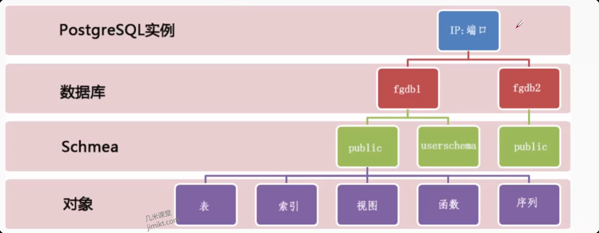

# 1. 体系结构

## 1.1. 物理结构
PostgreSQL 的物理结构主要由以下几个部分组成：一系列后台进程、共享内存和磁盘文件。如图所示：

### 1.1.1 后台进程

主进程

- Postmaster 进程：负责监听客户端连接请求，管理子进程，处理信号等。

会话服务进程

- PostgreSQL 进程：每个客户端连接都会创建一个新的 PostgreSQL 进程，负责处理该连接的请求。

辅助子进程

- Bgwriter 进程：负责将脏页写回磁盘，减少 checkpoint 时的 I/O 压力。
- Checkpoint 进程：负责定期执行 checkpoint 操作，确保数据的持久化。
- WALWrite 进程：负责将 WAL 日志写入磁盘，确保数据的持久化和恢复能力。
- AutoVacuum 进程：负责自动清理和分析数据库，保持数据库的性能。
- PgArch 进程：负责将 WAL 日志归档到指定位置，确保数据的安全性和恢复能力。
- PgStat 进程：负责收集数据库的统计信息，供查询优化器使用。

### 1.1.2. 内存

共享内存：用于进程间通信和数据共享，包含以下几个主要区域：

- 数据缓冲区（Shared Buffer）：用于缓存数据页，减少磁盘 I/O，提高查询性能。

- XLOG 缓冲区（XLOG Buffer）：用于缓存 WAL 日志，确保数据的持久化和恢复能力。

- 除此之外，还有锁管理器、事务管理器等共享内存区域，用于协调多个进程之间的操作。

本地内存：每个 PostgreSQL 进程都有自己的本地内存，用于存储该进程的私有数据，如查询计划、执行状态等。

- 临时缓冲区：用于存储查询过程中产生的临时数据，如排序结果、哈希表等。

- work_mem：用于存储查询过程中产生的临时数据，如排序结果、哈希表等，超过 work_mem 大小的数据会被写入磁盘。

- maintenance_work_mem：用于存储维护操作过程中产生的临时数据，如 VACUUM、CREATE INDEX 等，超过 maintenance_work_mem 大小的数据会被写入磁盘。

### 1.1.3. 磁盘文件

数据文件：存储数据库表、索引等数据结构。

WAL 文件：存储 WAL 日志，用于数据的持久化和恢复。

配置文件：存储 PostgreSQL 的配置参数，如 postgresql.conf、pg_hba.conf 等。

日志文件：存储 PostgreSQL 的运行日志，便于调试和监控。

### 1.2. 逻辑结构

PostgreSQL 的逻辑结构主要由以下几个层次组成：数据库实例、数据库、模式、表等。如图所示：

#### 1.2.1. 数据库实例
数据库实例是 PostgreSQL 的最高层次的逻辑结构，包含一个或多个数据库。一个数据库实例由一个 postmaster 进程管理，所有的数据库共享同一套后台进程和共享内存资源。

#### 1.2.2. 数据库
数据库是 PostgreSQL 的第二层次的逻辑结构，每个数据库包含一个独立的命名空间和数据存储。每个数据库都有自己的系统目录、数据文件和配置参数。

#### 1.2.3. 模式
模式是数据库中的一个命名空间，用于组织数据库对象，如表、视图、函数等。每个数据库可以包含多个模式，默认情况下，每个数据库都有一个名为 public 的模式。

#### 1.2.4. 表
表是数据库中的基本数据存储结构，用于存储数据记录。每个表由一个或多个列组成，每列具有特定的数据类型和约束条件。表可以通过 SQL 语句进行创建、修改和查询。

#### 1.2.5. 其他数据库对象
除了表之外，PostgreSQL 还支持其他类型的数据库对象，如视图、索引、函数、触发器等。这些对象可以帮助用户更高效地存储和查询数据，提高数据库的性能和可用性。

